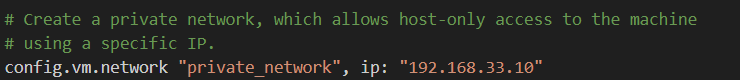
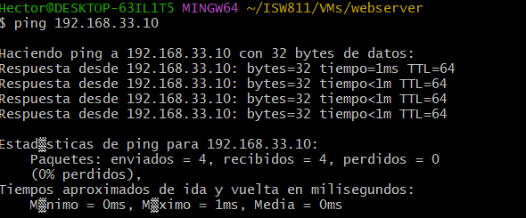
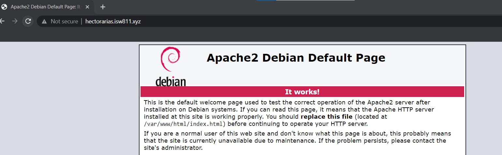
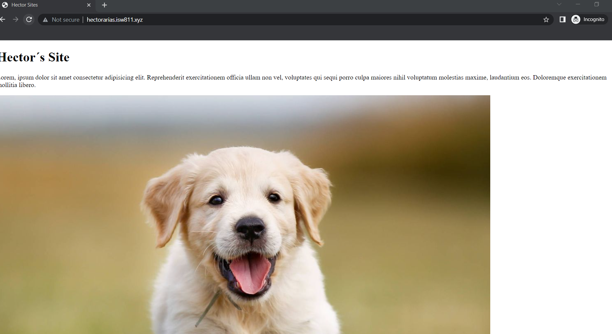

# Workshop 02
## Hector Arias

## ¿Que necesitamos para desplegar una aplicacion web?


- Servidor
- Dominio
- Una IP 
- Una app (backend, frontend, fullstack)
- Una base de datos
- Presupuesto
- Seguridad
    - Firewall

- SEO
     - Analitica


## Implementacion de servidor LAMP

### Cambiar el hostname

Este comando debe ejecutarse dentro de la maquina virtual a la que deseamos cambiarle el nombre de <<host>>. Luego salimos y volvemos a ingresar
 
 ```bash 
 sudo hostnamectl set-hostname webserver
 Exit
 vagrant ssh
 ```


## Actualizar el hostname en el archivo hosts

Para completar el cambio del hostname hay que actualizar el nombre del maquina en el archivo hosts. En GNU/Linux este archivo se ubica en '/etc/hosts'

 ```bash 
 sudo nano /etc/hosts
 ```


 ## Actualizar la lista de paquetes elegibles

 Antes de instalar cualquier paquete desde los repositorios oficiales, debemos actualizar la base de datos de los paquetes.

 Esto se debe ejecutar en la maquina virtual.

  ```bash 
 sudo apt-get update
 ```

 ## Instalacion Vim, cURL, Apache, mariaDB, PHP

 Con el siguiente comando

```bash 
 sudo apt-get install vim vim-nox \
    curl git apache2 mariadb-server mariadb-client \
    php7.4 php7.4-bcmath php7.4-curl php7.4-json \
    php7.4-mbstring php7.4-mysql php7.4-xml
```


## Comprobar la IP del servidor

Desde la maquina virtual anfitriona vamos a verificar la IP definida en el Vagrantfile el parametro private network



Despues darle ping




## Entrar al archivo hosts desde Windows

```bash 
 cd /
 cd Windows/System32/drivers/etc
 notepad hosts
```

Aqui agregamos la entrada correspondiente para simular la resolucion del dominio


## Entrar al archivo hosts desde GNU/Linux

```bash 
 sudo nano /etc/hosts
```


## Para verificar el default site

Para visualizar el sitio por defecto de Apache visitamos la URL: hectorarias.isw811.xyz




## Habilitar Modulos 

Vamos habilitar los modulos necesarios para soportar hosts virtuales y certificados SSL


```bash 
 sudo a2enmod vhost_alias rewrite ssl
```

Despues lo vamos a reiniciar con este comando

```bash 
 sudo sudo systemctl restart apache2
```

## Montar carpeta de sitios («sites» quedará montada en dos ubicaciones)

Para mejorar el flujo de trabajo vamos a crear un folder local y lo
sincronizamos contra la ruta /home/vagrant/sites de la máquina virtual

```bash 
46 # config.vm.synced_folder "../data","/vagrant_data"
47 config.vm.synced_folder "sites/","/home/vagrant/sites",owner: "www-data", group: "www-data"
```


## Reiniciar la máquina

Luego de modificar el Vagrantfile debemos reiniciar la máquina.

```bash 
exit
vagrant halt
vagant up
vagrant ssh
```


## Crear el «conf» para el sitio

Necesitaremos crear un archivo .conf para cada sitio que deseemos hospedar
en el servidor web. Vamos a crear una carpeta para ubicarlos y también
crearemos nuestro primer archivo .conf. Desde la máquina anfitriona

```bash 
mkdir confs
cd confs
touch hectorarias.isw811.xyz.conf
code hectorarias.isw811.xyz.conf
```


A continuación el contenido del archivo .conf para el sitio hectorarias.isw811.xyz.


```bash 
    <VirtualHost *:80>
  ServerAdmin webmaster@mizaq.isw811.xyz
  ServerName mizaq.isw811.xyz

  # Indexes + Directory Root.
  DirectoryIndex index.php index.html
  DocumentRoot /home/vagrant/sites/mizaq.isw811.xyz

  <Directory /home/vagrant/sites/mizaq.isw811.xyz>
    DirectoryIndex index.php index.html
    AllowOverride All
    Require all granted
  </Directory>

  ErrorLog ${APACHE_LOG_DIR}/mizaq.isw811.xyz.error.log
  LogLevel warn
  CustomLog ${APACHE_LOG_DIR}/mizaq.isw811.xyz.access.log combined
    </VirtualHost>

```

## Copiar «conf» a «sites-available»

Ahora desde la máquina virtual vamos a copiar el archivo .conf a la ruta de
sitios disponibles de Apache2.

```bash 
sudo cp /vagrant/confs/mizaq.isw811.xyz.conf
/etc/apache2/sites-available

```


## Verificar la configuración de Apache

Cuando agreguemos un archivo .conf al directorio de sitios disponibles
debemos reiniciar Apache, pero antes debemos comprobar que en los
archivos de configuración recién agregados no se haya introducido ningún
error, lo cual impide el reinicio de Apache.

```bash 
sudo apache2ctl -t
```


## Configurar el parámetro «ServerName»

Al probar la configuración de Apache obtenemos el error "Could not reliably
determine the server's fully qualified domain name", debemos ejecutar el
siguiente comando, para agregar la directiva «SeverName» al archivo de
configuración general de Apache.


```bash 
echo "ServerName webserver" | sudo tee -a
/etc/apache2/apache2.conf
```


## Habilitar el servicio nuevo

Volvemos a comprobar la configuración con el comando apache2ctl -t, si ya no aparecen
errores podemos habilitar el sitio con el comando a2ensite, y por último se reinicia
Apache.

```bash 
sudo apache2ctl -t
sudo a2ensite hectorarias.isw811.xyz.conf
sudo systemctl restart apache2.service
```


## Verificar el nuevo sitio

Para visualizar el nuevo sitio desde la máquina anfitriona visitamos la URL
http://hectorarias.isw811.xyz o el nombre de dominio que le nombro.



